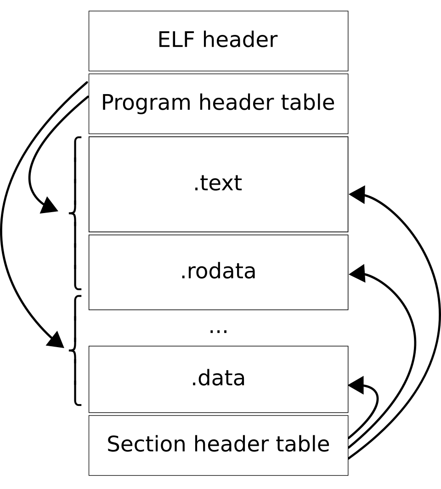

Title:
---


<!-- pause -->
<!-- alignment: center -->
<!-- font_size: 2 -->
So who's ready to talk about bare metal executables and memory?

"Bare Metal" Executables
---
<!-- font_size: 2 -->
Okay so what does that mean?

q: What is "bare metal"?

<!-- pause -->
When we program for linux, how is that not bare metal?
<!-- pause -->
What does linux *do* that the CPU does not?

Obviously we can make a list...
- Parse Executable Formats
- Dynamic Linking
- Schedule Programs and Threads
- Provide abstractions over hardware
- Page Table Management
- Provide OS resources
- Allow access to a filesystem

No
---
<!-- font_size: 2 -->
<!-- pause -->
That's probably not a helpful way of thinking about it.
<!-- pause -->
Close your eyes.
<!-- pause -->
Deep breaths.
<!-- pause -->
Imagine you're a CPU. No OS. Just you, some RAM, and an array of VGA memory.
<!-- pause -->
All you can do is execute instructions deterministically.

Bare Metal is Just The CPU and You
---
<!-- font_size: 2 -->
The program gets loaded into memory, and begins executing at the first byte of memory.
That's it. It runs until the program completes.
<!-- pause -->
This is what QEMU does. It pretends that it's a CPU with memory.

Memory
---
<!-- font_size: 2 -->
It's impossible to understand QEMU without understanding memory, since it needs to emulate that as well.
<!-- font_size: 1 -->
```
                               ┌──────────┐                       ┌──────────────────────┐
Start of Memory ─►  0x80000000 │   Bios   │ VGA Memory ─► 0xb8000 │ VGA memory is simply │
                         │     ├──────────┤                       │ an array of bytes,   │
                         │     │          │ End of VGA ─► 0xc2000 │ just like all memory │
                         │     │  Kernel  │                       └──────────────────────┘
                         │     │          │                                               
                         │     ├──────────┤   Misc. Devices ─┐    ┌──────────────────────┐
                         │     │          │                  ├───►│                      │
                         │     │ Free mem │                  │    │                      │
                         │     │ to be    │                  │    └──────────────────────┘
                         │     │ used by  │                  │                            
                         │     │ the      │                  │    ┌──────────────────────┐
                         │     │ kernel.  │                  │    │                      │
                         │     │          │                  │    │                      │
                         │     │          │                  ├──► │                      │
                         │     │          │                  │    │                      │
                         │     │          │                  │    └──────────────────────┘
                         │     │          │                  │                            
                         │     │          │                  │    ┌──────────────────────┐
                         │     │          │                  ├──► │                      │
                         │     │          │                  │    └──────────────────────┘
                         │     │          │                  │                            
                         │     │          │                  └──► ┌──────────────────────┐
                         ▼     │          │                       └──────────────────────┘
   End of Memory ─► 0x80000000 │          │                                               
                        + SIZE └──────────┘                                               
```
The MMU handles this.

Zooming In
---
<!-- font_size: 2 -->
If we zoom in, memory looks like this locally:
<!-- font_size: 1 -->
```
          0x__  0 1 2 3 4 5 6 7 8 9 a b c d e f  
               ┌─┬─┬─┬─┬─┬─┬─┬─┬─┬─┬─┬─┬─┬─┬─┬─┐ 
Offset -> 0x00 │ │ │ │ │ │ │ │ │ │ │ │ │ │ │ │ │ 
from beg.      ├─┼─┼─┼─┼─┼─┼─┼─┼─┼─┼─┼─┼─┼─┼─┼─┤ 
addr      0x10 │ │ │ │ │ │ │ │ │ │ │ │ │ │ │ │ │ 
               ├─┼─┼─┼─┼─┼─┼─┼─┼─┼─┼─┼─┼─┼─┼─┼─┤ 
          0x20 │ │ │ │ │ │ │ │ │ │ │ │ │ │ │ │ │ 
               ├─┼─┼─┼─┼─┼─┼─┼─┼─┼─┼─┼─┼─┼─┼─┼─┤ 
          0x30 │ │ │ │ │ │ │ │ │ │ │ │ │ │ │ │ │ 
               ├─┼─┼─┼─┼─┼─┼─┼─┼─┼─┼─┼─┼─┼─┼─┼─┤ 
          0x40 │ │ │ │ │ │ │ │ │ │ │ │ │ │ │ │ │ 
               ├─┼─┼─┼─┼─┼─┼─┼─┼─┼─┼─┼─┼─┼─┼─┼─┤ 
          0x50 │ │ │ │ │ │ │ │ │ │ │ │ │ │ │ │ │ 
               ├─┼─┼─┼─┼─┼─┼─┼─┼─┼─┼─┼─┼─┼─┼─┼─┤ 
          0x60 │ │ │ │ │ │ │ │ │ │ │ │ │ │ │ │ │ 
               ├─┼─┼─┼─┼─┼─┼─┼─┼─┼─┼─┼─┼─┼─┼─┼─┤ 
          0x70 │ │ │ │ │ │ │ │ │ │ │ │ │ │ │ │ │ 
               ├─┼─┼─┼─┼─┼─┼─┼─┼─┼─┼─┼─┼─┼─┼─┼─┤ 
          0x80 │ │ │ │ │ │ │ │ │ │ │ │ │ │ │ │ │ 
               ├─┼─┼─┼─┼─┼─┼─┼─┼─┼─┼─┼─┼─┼─┼─┼─┤ 
          0x90 │ │ │ │ │ │ │ │ │ │ │ │ │ │ │ │ │ 
               ├─┼─┼─┼─┼─┼─┼─┼─┼─┼─┼─┼─┼─┼─┼─┼─┤ 
          0xa0 │ │ │ │ │ │ │ │ │ │ │ │ │ │ │ │ │ 
               ├─┼─┼─┼─┼─┼─┼─┼─┼─┼─┼─┼─┼─┼─┼─┼─┤ 
          0xb0 │ │ │ │ │ │ │ │ │ │ │ │ │ │ │ │ │ 
               ├─┼─┼─┼─┼─┼─┼─┼─┼─┼─┼─┼─┼─┼─┼─┼─┤ 
          0xc0 │ │ │ │ │ │ │ │ │ │ │ │ │ │ │ │ │ 
               └─┴─┴─┴─┴─┴─┴─┴─┴─┴─┴─┴─┴─┴─┴─┴─┘ 
               ...                               
```
<!-- font_size: 2 -->
<!-- pause -->
Each square represents a byte.

Memory
---
<!-- font_size: 2 -->
Each byte has a unique index in this giant array. This index is what is stored as a pointer.
<!-- pause -->
Dereferencing a pointer is indexing into the array.

<!-- pause -->
Malloc, the homework, was supposed to help everyone understand this in a practical sense.

Unfortunately, real (or emulated) hardware is more complicated.

Executable Files
---
<!-- font_size: 2 -->
How do you execute a program?
<!-- pause -->
The simplest way to execute a program would be to copy it into memory, and then begin executing at the
beginning of the copied memory.

This is inefficient. If our program needs 200 MiB of stack space, that has to be part of the executable file.

Instead, we use something called and ELF file. It contains all program data, but begins with a header which tells
Linux how to load the program into memory.

ELF
---
<!-- font_size: 2 -->
This is the format for an ELF file.



ELF Cont
---
<!-- font_size: 2 -->
When a program is compiled, it's split into sections.

- `.text`: Program Code
- `.data`: Initalized *Static* Data (rust `static mut`s)
- `.rodata`: Read-Only Data (rust `static`s)
- `.bss`: Uninitialized/Zero Initalized Statics
- `.init`/`.fini`: functions run before main/after main returns
- And a few more we don't care about.
<!-- pause -->
How the program sections are loaded into memory is determined by the linker using linker script.
If the script says that `.text` should be loaded at `0x80000000`, it will be.
<!-- pause -->
This data is stored in the headers of the ELF file.

`readelf`
---
<!-- font_size: 2 -->
We can actually use a linux command, `readelf`, to read some of this.

(GOTO example)

<!-- pause -->
Importantly, QEMU reads this as well, and copies our compiled kernel into memory the same way.

This is why we need a linker script to compile a bare-metal executable, because otherwise
we cannot control the memory address of the entry point of our program, which must be the start of QEMU memory
(or the entry point specified by the BIOS).

Linker Script Example
---
QEMU memory starts at `0x80000000` for RISC-V. x86 is more complicated.

`.` represents the current memory address, which increments as data is added.

<!-- font_size: 1 -->
```ld
ENTRY(boot)

SECTIONS {
    . = 0x80000000;

    .text :{
        KEEP(*(.text.boot)); // `boot` function
        *(.text .text.*);
        . = ALIGN(8);
        *(.text.stvec)
    }

    .rodata : ALIGN(8) {
        *(.rodata .rodata.*);
    }

    .data : ALIGN(8) {
        *(.data .data.*);
    }

    .bss : ALIGN(8) {
        __bss = .;
        *(.bss .bss.* .sbss .sbss.*);
        __bss_end = .;
    }

    . = ALIGN(16);
    . += 1024 * 1024 * 2;
    __stack_top = .;

    /DISCARD/ : {
        *(.eh_frame);
    }
}
```

MMIO
---
<!-- font_size: 2 -->
Lets go back to memory. (slide 7)
<!-- pause -->
Sometimes, as for VGA memory, these bytes aren't RAM.

RAM is the memory we're used to in consumer electronics.

Writes to addresses that aren't RAM are, once again, managed by the MMU to
output data to the device, which the device firmware reads and manages.
<!-- pause -->
VGA is one of these.

Now
---
<!-- font_size: 2 -->
Now, I know there are things people don't understand. It's basically impossible for that to not be the case.
<!-- pause -->
This stuff is hard.
<!-- pause -->
*Nothing* is too small to ask about. Maybe it's the one piece of the puzzle which helps you understand everything else.
<!-- pause -->
Ask me your questions, *anything* now. Take time to come up with them. I'll pass around paper to write them down if you don't want to ask directly.


